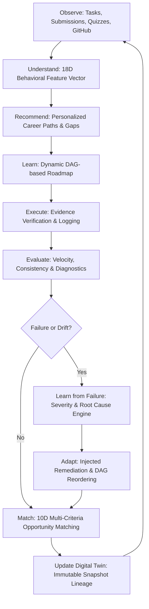

# Opportunity Pathfinder — AI Career Operating System

<div align="center">


**An intelligent, research-grade AI Career Operating System based on a continuously evolving Student Digital Twin and closed-loop career guidance.**

[Architecture](docs/ARCHITECTURE.md) • [Database](docs/DATABASE.md) • [AI Formulas](docs/AI_ENGINE.md) • [Digital Twin](docs/DIGITAL_TWIN.md) • [Adaptive Engine](docs/ADAPTIVE_ENGINE.md) • [16-Step Demo](docs/DEMO.md) • [Research](docs/RESEARCH.md)

</div>

---

## 1. System Vision & The Closed-Loop Breakthrough

Traditional career planning platforms are static, superficial, and disconnected:
* They rely on one-time surveys or static quizzes.
* They generate rigid, linear roadmaps that break the moment a student fails an assessment or falls behind.
* They recommend jobs purely through naive keyword matching, ignoring whether the candidate actually has the execution consistency and interview readiness to pass hiring bars.

**Opportunity Pathfinder** solves this by establishing an autonomous **closed-loop feedback cycle**:



---

## 2. Key Modules & Subsystems

1. **Student Digital Twin Engine (`/digital-twin`)**:
   * Extracts an **18-dimensional normalized feature vector** representing cognitive mastery, project depth, problem-solving, consistency, communication, and interview capability.
   * Tracks an **immutable snapshot lineage (v1 \(\rightarrow\) vN)** documenting the historical evolution and trigger events for every change in student state.
2. **Skill Intelligence & Prerequisite DAG (`/skills`, `/career-paths`)**:
   * Graph-based prerequisite modeling prevents students from jumping to advanced frameworks before mastering core foundations.
3. **Personalized Roadmap & Evidence Workbench (`/roadmap`, `/tasks`)**:
   * Decomposes multi-month goals into milestones, micro-tasks, and verifiable evidence artifacts (GitHub repositories, commits, live URLs).
4. **Failure Intelligence & Adaptive Replanning (`/failures-successes`, `/adaptations`)**:
   * Classifies failures (`ASSESSMENT_FAILURE`, `STAGNATION_DRIFT`, `INTERVIEW_REJECTION`) with explicit confidence levels (`OBSERVED`, `LIKELY`, `UNKNOWN`).
   * Automatically executes replanning policies: `INJECT_REINFORCEMENT` (injected remediation phases) and `REORDER_DAG` (dependency repairs).
5. **10D Readiness Radar & Opportunity Matching (`/opportunities`, `/readiness`)**:
   * Mathematically decouples **Opportunity Match %** from **Career Readiness %**.
   * Renders a 10-dimensional visual radar chart across Technical Skills, Projects, Problem Solving, Communication, Interview Readiness, Resume Quality, Portfolio, Consistency, System Knowledge, and Academics.
6. **Diagnostic Interview Simulator (`/interview`)**:
   * Question bank with automated evaluation, weakness detection, and instant feedback.
7. **Research Lab & 16-Step Scenario Simulator (`/research-lab`)**:
   * Replays the complete 16-step closed-loop lifecycle end-to-end with live console output, telemetry graphs, and CSV data export.

---

## 3. Technology Stack

* **Backend**: Java 17, Spring Boot 3.2.0, Spring Security 6 (Stateless JWT), Spring Data JPA, Hibernate, JJWT 0.11.5, SpringDoc OpenAPI 2.3.0.
* **Frontend**: React 18, Vite 5, TypeScript 5, Tailwind CSS, Lucide React, Recharts (Radar, Area, Bar, Line charts), Axios.
* **Databases**:
  * **Standalone Mode**: File-backed persistent PostgreSQL-compatibility mode via H2 (`jdbc:h2:file:./data/pathfinder_db;MODE=PostgreSQL`). Zero external installation required!
  * **Production Mode**: PostgreSQL 16 via Docker Compose.
* **ML Service**: Python 3.11, FastAPI, scikit-learn (Random Forest Regressor), TF-IDF, NumPy.

---

## 4. Quickstart Guide (Running the System)

### Option A: Local One-Click Startup (Recommended)

#### 1. Backend (Spring Boot 3)
```cmd
cd d:\pathfinder\backend
mvn spring-boot:run
```
* Backend starts at `http://localhost:8080`.
* Swagger API docs: `http://localhost:8080/swagger-ui.html`.
* H2 Database Console: `http://localhost:8080/h2-console` (JDBC URL: `jdbc:h2:file:./data/pathfinder_db`, User: `sa`, Password: empty).

#### 2. Frontend (React + Vite)
```cmd
cd d:\pathfinder\frontend
npm run dev
```
* Open your browser at `http://localhost:5173`.

#### 3. Python ML Service (Optional)
```cmd
cd d:\pathfinder\ml-service
pip install -r requirements.txt
uvicorn app.main:app --port 8001 --reload
```
*(Note: If the Python ML service is not running, the backend automatically uses its high-precision deterministic Java calculation engine with zero interruption).*

---

### Option B: Docker Compose (All-in-One Containerized)
```cmd
docker-compose up --build
```
* Frontend: `http://localhost:3000`
* Backend: `http://localhost:8080`
* Swagger: `http://localhost:8080/swagger-ui.html`
* Python ML: `http://localhost:8001`
* PostgreSQL: `localhost:5432`

---

## 5. Seed Demonstration Credentials

The database automatically initializes on startup with a realistic CS/IT student profile as defined in Section 42 of the build specification:

| Field | Demo Student | Admin User |
| :--- | :--- | :--- |
| **Email** | `student@example.com` | `admin@example.com` |
| **Password** | `password123` | `admin123` |
| **Role** | Student (`ROLE_STUDENT`) | Administrator (`ROLE_ADMIN`) |
| **Persona** | Alex Chen, Junior CS major, State Univ | System Administrator |

---

## 6. Verifying the 16-Step Closed-Loop Scenario

1. Log into the application at `http://localhost:5173` with `student@example.com` / `password123`.
2. Click **"Research Lab"** on the left navigation bar.
3. Click the **"Execute 16-Step Scenario"** button.
4. Watch the system execute:
   * Verification of initial profile (Twin v1).
   * Career path target selection (Backend Developer).
   * Skill gap analysis & automated roadmap generation.
   * Milestone submission with GitHub evidence (Twin advances v1 \(\rightarrow\) v2).
   * Simulated SQL assessment failure (Score: 42%).
   * Diagnosis of failure severity (HIGH, Confidence: OBSERVED).
   * Closed-loop adaptive replanning (`INJECT_REINFORCEMENT`).
   * Injection of remediation phase (Twin advances v2 \(\rightarrow\) v3).
   * Remediation drills & diagnostic retest completion (Score: 88%).
   * Unblocking of prerequisites (Twin advances v3 \(\rightarrow\) v4).
   * Multi-criteria opportunity matching against Stripe Backend Intern.
   * Production of transparent explainability rationale.

---

## 7. Verification & Automated Test Suite

Run the full automated test suite verifying mathematical formulas, integration flows, and the 16-step scenario:
```cmd
cd d:\pathfinder\backend
mvn clean test
```
**Test Results**:
```
[INFO] Tests run: 5, Failures: 0, Errors: 0, Skipped: 0
[INFO] BUILD SUCCESS
```

Build the production frontend bundle:
```cmd
cd d:\pathfinder\frontend
npm run build
```
**Build Results**:
```
✓ built in 3.08s (0 TypeScript errors)
```

---

## 8. Repository Structure

```
d:\pathfinder\
├── backend/                  # Java 17 / Spring Boot 3 Core Backend
│   ├── src/main/java/com/pathfinder/
│   │   ├── auth/             # JWT, Security, User Repository
│   │   ├── profile/          # Student Profile, Academics, Projects
│   │   ├── skills/           # Skill catalog, Prerequisite DAG
│   │   ├── digitaltwin/      # 18D Feature Vector, Snapshot Lineage
│   │   ├── career/           # Career Paths, Skill Gap Engine
│   │   ├── learning/         # Roadmaps, Phases, Tasks, Evidence
│   │   ├── execution/        # Study Logs, Velocity & Consistency
│   │   ├── intelligence/     # Failures (Observed/Likely/Unknown), Successes
│   │   ├── adaptive/         # Closed-Loop Replanning Policies
│   │   ├── opportunity/      # Match % vs Readiness %, 10D Radar
│   │   ├── interview/        # Mock Interview Diagnostic Bank
│   │   ├── resume/           # Competency Extraction Engine
│   │   ├── evaluation/       # Precision@K, NDCG, Ablation Studies
│   │   ├── seed/             # DataInitializer & 16-Step Demo Scenario
│   │   └── common/           # AuditLogService, GlobalExceptionHandler
│   ├── src/test/java/        # Integration & Unit Test Suite
│   └── pom.xml
├── frontend/                 # React 18 / Vite / TypeScript / Tailwind CSS
│   ├── src/
│   │   ├── components/       # AppLayout, Navbar, Sidebar
│   │   ├── context/          # AuthContext with token refresh
│   │   ├── pages/            # 16 High-Fidelity Domain Pages
│   │   └── services/         # Axios API Client with interceptors
│   ├── package.json
│   └── vite.config.ts
├── ml-service/               # Python 3.11 / FastAPI / scikit-learn
│   ├── app/main.py           # Random Forest Regressor & TF-IDF
│   └── requirements.txt
├── docs/                     # Full Technical Architecture & Specs
│   ├── ARCHITECTURE.md       # Multi-tier System Design
│   ├── DATABASE.md           # Schema ERD & Data Dictionary
│   ├── AI_ENGINE.md          # Complete Mathematical Formulas
│   ├── DIGITAL_TWIN.md       # 18D Vector & Snapshot Lineage
│   ├── ADAPTIVE_ENGINE.md    # Closed-Loop Replanning Mechanics
│   ├── ML.md                 # Machine Learning Models
│   ├── API.md                # 50+ REST API Endpoints
│   ├── RESEARCH.md           # IR Metrics & Ablation Studies
│   └── DEMO.md               # 16-Step Scenario Walkthrough
├── docker-compose.yml        # Multi-container orchestration
├── start.bat                 # Windows one-click local launcher
└── start.sh                  # Linux/macOS launcher
```

---

## 9. License

This project is licensed under the MIT License. Built for advanced research in autonomous educational systems and AI career guidance.
