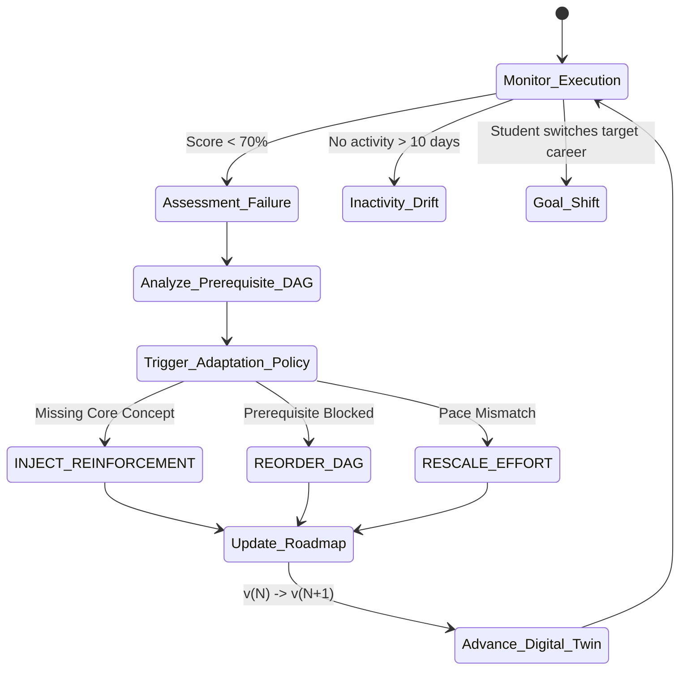

# Adaptive Planning & Closed-Loop Replanning Engine

## 1. The Closed-Loop Adaptation Philosophy

Static career roadmaps fail because students inevitably hit roadblocks:
* A difficult concept (e.g., SQL window functions, concurrent programming) is failed.
* Consistent study habits break down due to exams or personal commitments.
* Downstream tasks cannot be understood because prerequisite foundations are shaky.

The **Adaptive Planning Engine** (`com.pathfinder.adaptive`) continuously inspects the Student Digital Twin and roadmap execution records to trigger automated closed-loop interventions.

---

## 2. Adaptation Trigger Conditions

| Trigger Type | Diagnostic Detection Rule | Severity | Engine Action |
| :--- | :--- | :--- | :--- |
| **`ASSESSMENT_FAILURE`** | Milestone or diagnostic quiz score \(< 70.0\%\) | `HIGH` / `CRITICAL` | Lock downstream tasks; inject remediation module |
| **`PREREQUISITE_BLOCKED`** | Advanced skill attempted while prerequisite \(\text{Proficiency} < 60\%\) | `HIGH` | Re-sequence roadmap to complete prerequisite first |
| **`VELOCITY_STAGNATION`** | Zero hours logged or no commits across 10 consecutive days | `MEDIUM` | Split upcoming milestones into micro-tasks (\(\le 2\) hrs) |
| **`INTERVIEW_WEAKNESS`** | Mock interview score in specific category \(< 60\%\) | `HIGH` | Inject behavioral / architecture mock drill phase |
| **`CAREER_GOAL_SHIFT`** | Student modifies primary target role | `INFO` | Re-evaluate skill gaps and generate new roadmap v2 |

---

## 3. Replanning Policies & Execution Mechanics

### 3.1 Policy 1: `INJECT_REINFORCEMENT`
* **When Triggered**: Student fails a conceptual assessment (e.g., SQL Joins & Window Functions).
* **Action**:
  1. Identifies the failed skill node.
  2. Queries the skill repository for targeted practice drills, interactive sandboxes, and documentation.
  3. Creates a new `RoadmapPhase` titled `"Adaptive Reinforcement: [Skill] Mastery & Remediation"`.
  4. Inserts micro-tasks: Conceptual review, diagnostic drills, and reassessment exam.
  5. Inserts this phase immediately before any dependent downstream phases (e.g., Spring Data JPA, Microservices).

### 3.2 Policy 2: `REORDER_DAG`
* **When Triggered**: Topologically invalid execution order or prerequisite violations.
* **Action**:
  1. Traverses the `SkillPrerequisite` DAG.
  2. Recomputes topological sort order based on student's current proficiencies.
  3. Re-numbers `phase_order` and `task_order` so that foundational competencies precede advanced frameworks.

### 3.3 Policy 3: `RESCALE_EFFORT`
* **When Triggered**: Persistent velocity lag (\(\text{Velocity} < 50\%\)).
* **Action**:
  1. Multiplies estimated hours by student's empirical velocity factor (\(1.2 \times - 1.5 \times\)).
  2. Shifts target completion dates forward realistically to prevent burnout and despair.
  3. Decomposes high-effort tasks (\(> 10\) hours) into atomic 2-hour sub-tasks.

---

## 4. Remediation Verification & State Resolution

Once an injected reinforcement phase is active:
1. Downstream phases remain locked.
2. The student completes the remediation tasks and takes a **Diagnostic Retest**.
3. If Retest Score \(\ge 75.0\%\):
   * Skill proficiency is elevated in `StudentSkill`.
   * Prerequisite lock is removed.
   * `DigitalTwinSnapshot` is committed with trigger `REMEDIATION_MASTERY_ACHIEVED`.
   * Digital Twin version increments (e.g., v3 \(\rightarrow\) v4).
   * Downstream learning phases unlock automatically.
