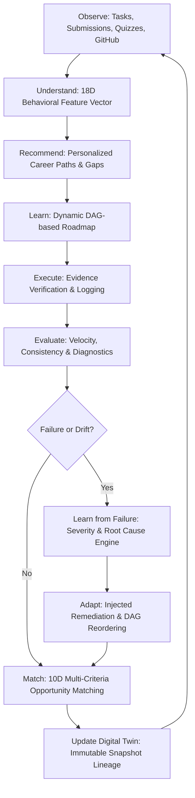

# Opportunity Pathfinder — System Architecture Specification

## 1. Architectural Philosophy & Overview

**Opportunity Pathfinder** is an enterprise-grade AI Career Operating System designed to model, guide, adapt, and accelerate student career development through a continuously evolving **Student Digital Twin**.

Rather than offering static career quizzes, disconnected skill lists, or superficial generative chatbots, Opportunity Pathfinder operates on a rigorous **closed-loop feedback cycle**:



---

## 2. Multi-Tier Distributed Architecture

The system is organized into a modular four-tier architecture:

```mermaid
flowchart TB
    subgraph Client Tier [Client Tier - React 18 / Vite / TypeScript]
        UI[Tailwind CSS SaaS UI]
        D_PAGE[Digital Twin Inspector]
        R_PAGE[Interactive Roadmap & Task Workbench]
        RADAR[10D Readiness Radar Chart]
        DEMO[16-Step Scenario Lab & Simulator]
    end

    subgraph Gateway & Security [Spring Security 6 / JWT]
        AUTH_FILTER[Stateless JwtAuthenticationFilter]
        CORS[CORS Filter]
        AUDIT[AuditLog Aspect / Event Interceptor]
    end

    subgraph Application Core [Spring Boot 3 Core Services]
        subgraph Twin Module
            DT_ENGINE[DigitalTwinEngine]
            VEC_EXT[FeatureVector Extractor]
            SNAP_MGR[Snapshot Lineage Manager]
        end

        subgraph Career & Roadmap Module
            REC_ENG[CareerRecommendationEngine]
            GAP_ENG[SkillGapEngine]
            ROAD_ENG[LearningRoadmapEngine]
        end

        subgraph Intelligence & Adaptive Module
            FAIL_ENG[FailureAnalysisEngine]
            ADAPT_ENG[AdaptivePlanningEngine]
            EXEC_MON[ExecutionMonitoringEngine]
        end

        subgraph Matching & Evaluation
            MATCH_ENG[OpportunityMatchingEngine]
            READ_ENG[ReadinessAssessmentEngine]
            EVAL_ENG[ResearchEvaluationService]
        end
    end

    subgraph Data & Persistence [Storage Layer]
        POSTGRES[(PostgreSQL 16 / H2 File)]
        DATA_INIT[Seed Initializer & Scenario Service]
    end

    subgraph Intelligence Service [Python 3.11 ML Service]
        FASTAPI[FastAPI Gateway]
        RF_MODEL[RandomForest Readyness Scorer]
        TFIDF[TF-IDF Competency Parser]
    end

    UI --> AUTH_FILTER
    AUTH_FILTER --> Application Core
    Application Core --> POSTGRES
    MATCH_ENG <--> FASTAPI
```

---

## 3. Core Subsystems & Domain Modules

### 3.1 Student Digital Twin Engine (`com.pathfinder.digitaltwin`)
* **Mathematical Vector**: Extracts an 18-dimensional normalized feature vector `[0.0, 1.0]` across technical mastery, execution velocity, problem-solving, consistency, communication, and interview readiness.
* **Lineage & Snapshots**: Every transformative event (milestone submission, assessment failure, replanning adaptation, interview) persists an immutable snapshot with trigger metadata, state deltas, and timestamp.
* **Continuous Updates**: Real-time recalculation of velocity, consistency score (decay penalties for inactivity), and composite readiness score.

### 3.2 Skill Intelligence & Prerequisite DAG (`com.pathfinder.skills`)
* **Graph Structure**: Modeled as a Directed Acyclic Graph (DAG) using `SkillPrerequisite` entities.
* **Blocker Detection**: A student cannot proceed to advanced competencies (e.g., Spring Boot, Distributed Systems) if prerequisite nodes (Java OOP, Basic Networking) are below threshold proficiency.

### 3.3 Learning Roadmap & Execution Workbench (`com.pathfinder.learning`, `com.pathfinder.execution`)
* **Milestone Decomposition**: Automatically breaks multi-week goals into phases, tasks, actionable resources, estimated hours, and verification criteria.
* **Evidence-Based Submission**: Tasks require verifiable artifacts (GitHub repository URL, commit hash, live deployment URL, test results, code snippets) before status transitions to `VERIFIED`.

### 3.4 Failure Intelligence & Adaptive Replanning (`com.pathfinder.intelligence`, `com.pathfinder.adaptive`)
* **Diagnostic Categorization**: Distinguishes between `ASSESSMENT_FAILURE`, `STAGNATION_DRIFT`, `INTERVIEW_REJECTION`, and `DEADLINE_MISSED`.
* **Confidence Level**: Explicitly flags diagnosis confidence (`OBSERVED`, `LIKELY`, `UNKNOWN`) to avoid hallucinated feedback.
* **Replanning Policies**:
  * `INJECT_REINFORCEMENT`: Inserts dedicated remediation phases to address foundational flaws.
  * `REORDER_DAG`: Re-sequences tasks according to prerequisite dependencies.
  * `RESCALE_EFFORT`: Adjusts target dates and estimated hours based on historical student velocity.

### 3.5 Opportunity Matching & 10D Readiness (`com.pathfinder.opportunity`)
* **Strict Score Separation**:
  * **Opportunity Match Percentage**: Objective overlap between company mandatory/preferred skill requirements and student verified skills.
  * **Career Readiness Percentage**: Multi-factor capability composite assessing whether the student will actually pass interviews and succeed on the job.
* **10-Dimensional Radar**: Technical Skills, Projects, Problem Solving, Communication, Interview Readiness, Resume Quality, Portfolio Evidence, Consistency & Velocity, System Knowledge, and Academics.
* **Transparent Explainability**: Every recommendation outputs structured natural language justifications (`whyMatchedExplanation`, `readinessExplanation`).

---

## 4. Cross-Cutting Concerns

1. **Stateless Security**: Spring Security with JWT token generation and verification. Token expiration set to 24 hours. Passwords hashed using BCrypt.
2. **Comprehensive Audit Logging**: Centralized `AuditLogService` logging security, state mutation, digital twin advancement, and failure adaptation events.
3. **Database Portability**: Runs seamlessly on embedded file-backed PostgreSQL-mode H2 for zero-dependency local development, and scales to PostgreSQL 16 in containerized production.
4. **Resilient ML Integration**: If Python FastAPI service is offline or unreachable, backend gracefully falls back to deterministic Java mathematical heuristic engines with zero service interruption.
