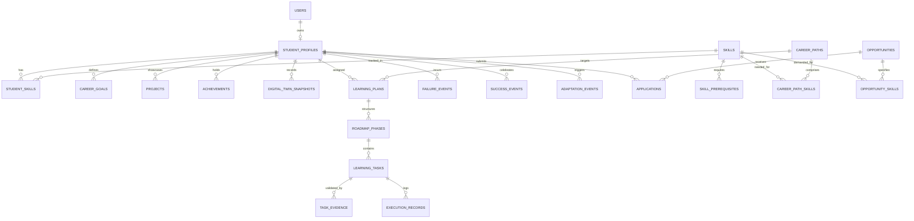
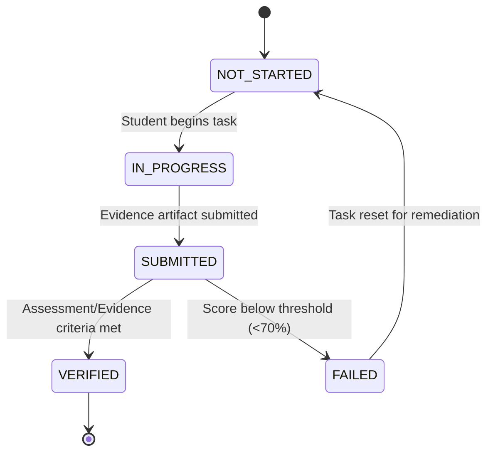
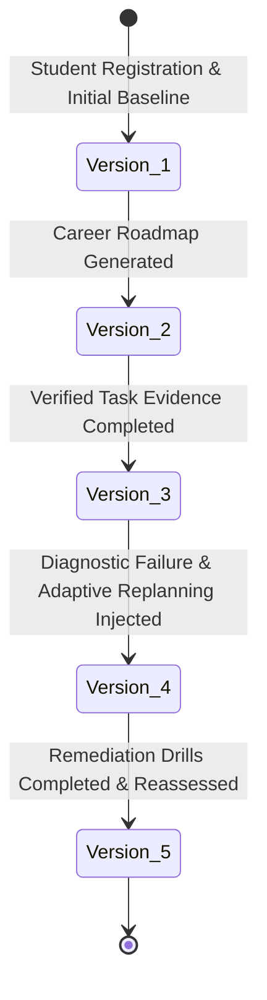

# Opportunity Pathfinder — Database Schema & Data Dictionary

## 1. Relational Entity Relationship Diagram

---

## 2. Core Table Definitions & Data Dictionary

### 2.1 Identity & Profile Tables
* `users`
  * `id` (BIGINT, PK, Auto-increment)
  * `email` (VARCHAR(150), UNIQUE, NOT NULL)
  * `password_hash` (VARCHAR(255), NOT NULL)
  * `full_name` (VARCHAR(100), NOT NULL)
  * `role` (VARCHAR(30), NOT NULL) — `ROLE_STUDENT`, `ROLE_ADMIN`, `ROLE_RESEARCHER`
  * `created_at`, `updated_at` (TIMESTAMP)

* `student_profiles`
  * `id` (BIGINT, PK)
  * `user_id` (BIGINT, FK -> users.id, UNIQUE)
  * `university` (VARCHAR(150))
  * `major` (VARCHAR(100))
  * `current_degree` (VARCHAR(50))
  * `graduation_year` (INT)
  * `gpa` (DOUBLE PRECISION)
  * `github_url`, `linkedin_url`, `portfolio_url` (VARCHAR(255))
  * `target_role` (VARCHAR(100))
  * `resume_text` (TEXT)

* `student_skills`
  * `id` (BIGINT, PK)
  * `student_profile_id` (BIGINT, FK -> student_profiles.id)
  * `skill_id` (BIGINT, FK -> skills.id)
  * `proficiency` (DOUBLE PRECISION, [0, 100])
  * `verified` (BOOLEAN, default FALSE)
  * `verification_source` (VARCHAR(100)) — `PROJECT_EVIDENCE`, `DIAGNOSTIC_ASSESSMENT`, `PEER_REVIEW`
  * `last_assessed_at` (TIMESTAMP)

### 2.2 Skill Graph & Career Paths
* `skills`
  * `id` (BIGINT, PK)
  * `name` (VARCHAR(100), UNIQUE, NOT NULL)
  * `category` (VARCHAR(50)) — `PROGRAMMING_LANGUAGE`, `FRAMEWORK`, `DATABASE`, `DEVOPS`, `SYSTEM_DESIGN`, `DATA_STRUCTURES_ALGORITHMS`
  * `description` (TEXT)
  * `difficulty_level` (INT, [1, 5])

* `skill_prerequisites`
  * `id` (BIGINT, PK)
  * `skill_id` (BIGINT, FK -> skills.id) — The downstream skill requiring prerequisites
  * `prerequisite_skill_id` (BIGINT, FK -> skills.id) — The prerequisite skill
  * `min_required_proficiency` (DOUBLE PRECISION, default 60.0)

* `career_paths`
  * `id` (BIGINT, PK)
  * `title` (VARCHAR(100), NOT NULL)
  * `domain` (VARCHAR(50))
  * `description` (TEXT)
  * `avg_salary_range` (VARCHAR(50))
  * `growth_outlook` (VARCHAR(50))

* `career_path_skills`
  * `id` (BIGINT, PK)
  * `career_path_id` (BIGINT, FK -> career_paths.id)
  * `skill_id` (BIGINT, FK -> skills.id)
  * `target_proficiency` (DOUBLE PRECISION)
  * `weight` (DOUBLE PRECISION, [0.0, 1.0])
  * `is_core` (BOOLEAN)

### 2.3 Student Digital Twin Lineage
* `digital_twin_snapshots`
  * `id` (BIGINT, PK)
  * `student_profile_id` (BIGINT, FK -> student_profiles.id)
  * `version` (INT, Monotonically increasing: 1, 2, 3...)
  * `trigger_event` (VARCHAR(100), NOT NULL) — e.g., `INITIAL_PROVISIONING`, `TASK_COMPLETED_WITH_EVIDENCE`, `ADAPTIVE_REPLANNING_EXECUTED`
  * `trigger_description` (TEXT)
  * `composite_readiness_score` (DOUBLE PRECISION)
  * `skill_proficiency_avg` (DOUBLE PRECISION)
  * `consistency_score` (DOUBLE PRECISION)
  * `velocity_score` (DOUBLE PRECISION)
  * `feature_vector_json` (TEXT) — Stores full 18-attribute JSON vector snapshot
  * `created_at` (TIMESTAMP, Immutable)

### 2.4 Learning Roadmap & Execution
* `learning_plans`
  * `id` (BIGINT, PK)
  * `student_profile_id` (BIGINT, FK -> student_profiles.id)
  * `career_path_id` (BIGINT, FK -> career_paths.id)
  * `title` (VARCHAR(150))
  * `status` (VARCHAR(30)) — `ACTIVE`, `COMPLETED`, `SUPERSEDED`
  * `version` (INT)
  * `created_at`, `updated_at` (TIMESTAMP)

* `roadmap_phases`
  * `id` (BIGINT, PK)
  * `learning_plan_id` (BIGINT, FK -> learning_plans.id)
  * `title` (VARCHAR(150))
  * `phase_order` (INT)
  * `description` (TEXT)
  * `status` (VARCHAR(30)) — `PENDING`, `IN_PROGRESS`, `COMPLETED`, `INJECTED_REMEDIATION`

* `learning_tasks`
  * `id` (BIGINT, PK)
  * `roadmap_phase_id` (BIGINT, FK -> roadmap_phases.id)
  * `skill_id` (BIGINT, FK -> skills.id, NULLABLE)
  * `title` (VARCHAR(200))
  * `description` (TEXT)
  * `resource_url` (VARCHAR(255))
  * `estimated_hours` (DOUBLE PRECISION)
  * `task_order` (INT)
  * `status` (VARCHAR(30)) — `NOT_STARTED`, `IN_PROGRESS`, `SUBMITTED`, `VERIFIED`, `FAILED`

* `task_evidence`
  * `id` (BIGINT, PK)
  * `learning_task_id` (BIGINT, FK -> learning_tasks.id)
  * `evidence_type` (VARCHAR(50)) — `GITHUB_REPO`, `COMMIT_HASH`, `LIVE_DEPLOYMENT`, `TEST_RESULTS`, `CODE_SNIPPET`
  * `evidence_url` (VARCHAR(255))
  * `evidence_text` (TEXT)
  * `score` (DOUBLE PRECISION)
  * `submitted_at` (TIMESTAMP)

### 2.5 Failure Intelligence & Adaptive Replanning
* `failure_events`
  * `id` (BIGINT, PK)
  * `student_profile_id` (BIGINT, FK -> student_profiles.id)
  * `failure_type` (VARCHAR(50)) — `ASSESSMENT_FAILURE`, `STAGNATION_DRIFT`, `INTERVIEW_REJECTION`, `DEADLINE_MISSED`
  * `context_name` (VARCHAR(200))
  * `skill_id` (BIGINT, FK -> skills.id, NULLABLE)
  * `score` (DOUBLE PRECISION)
  * `severity` (VARCHAR(20)) — `LOW`, `MEDIUM`, `HIGH`, `CRITICAL`
  * `confidence_level` (VARCHAR(20)) — `OBSERVED`, `LIKELY`, `UNKNOWN`
  * `root_cause_analysis` (TEXT)
  * `occurred_at` (TIMESTAMP)

* `adaptation_events`
  * `id` (BIGINT, PK)
  * `student_profile_id` (BIGINT, FK -> student_profiles.id)
  * `trigger_failure_id` (BIGINT, FK -> failure_events.id, NULLABLE)
  * `policy` (VARCHAR(50)) — `INJECT_REINFORCEMENT`, `REORDER_DAG`, `SPLIT_TASK`, `RESCALE_EFFORT`
  * `rationale` (TEXT)
  * `actions_summary` (TEXT)
  * `applied_at` (TIMESTAMP)

---

## 3. Lifecycle State Machines

### 3.1 Learning Task State Transitions

### 3.2 Digital Twin Lineage Advancement

