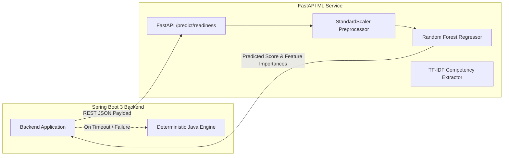

# Machine Learning Service & Predictive Modeling

## 1. Architecture & Service Contract

The **Opportunity Pathfinder ML Service** is a lightweight, high-performance microservice implemented in **Python 3.11** using **FastAPI**, **scikit-learn**, and **NumPy**. It complements the deterministic Java rules engines with predictive statistical models.

* **Port**: `8001`
* **Swagger Docs**: `http://localhost:8001/docs`
* **Health Check**: `GET /health`



---

## 2. Models & Predictive Algorithms

### 2.1 Random Forest Career Readiness Predictor (`/predict/readiness`)
* **Algorithm**: `RandomForestRegressor(n_estimators=100, max_depth=6, random_state=42)`
* **Input Features**:
  1. `skill_proficiency` (\([0, 100]\))
  2. `project_count` (integer)
  3. `problem_solving_score` (\([0, 100]\))
  4. `consistency_score` (\([0, 100]\))
  5. `interview_score` (\([0, 100]\))
  6. `academic_score` (\([0, 100]\))
* **Output Payload**:
  ```json
  {
    "predicted_readiness_score": 76.4,
    "confidence_interval": [72.1, 80.7],
    "top_contributing_features": [
      {"feature": "skill_proficiency", "importance": 0.34},
      {"feature": "project_count", "importance": 0.22},
      {"feature": "problem_solving_score", "importance": 0.18}
    ],
    "model_version": "rf-readiness-v1.2"
  }
  ```

### 2.2 TF-IDF Resume & Competency Matcher (`/parse/resume`)
* Uses `TfidfVectorizer(ngram_range=(1, 2), stop_words='english')` and cosine similarity against indexed skill taxonomies to extract competencies and experience depth from unformatted resume text.

---

## 3. High Availability & Resilience Design

In accordance with Section 35 of the Master Build Specification:
* **The system NEVER crashes if the ML service is down.**
* The Spring Boot backend uses a circuit-breaker / fallback pattern. If the Python service fails to respond within 800ms or throws a connection error, the backend transparently falls back to the Java deterministic heuristic formulas (`DigitalTwinEngine.calculateCompositeReadiness`) with zero user interruption and logs a warning in the audit stream.
